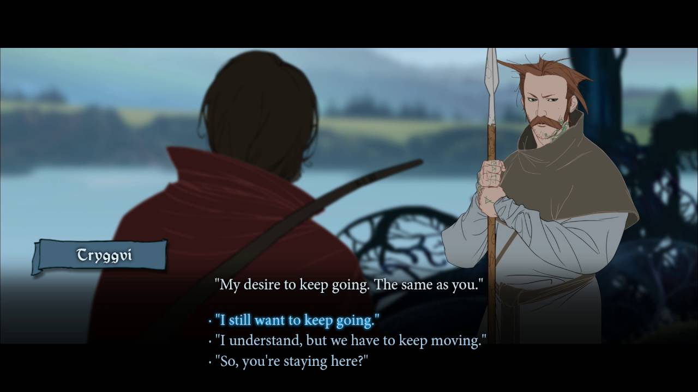
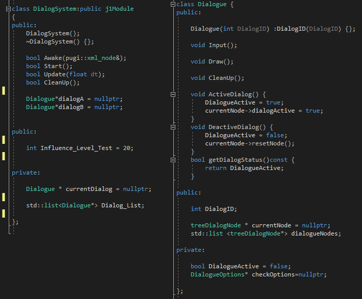
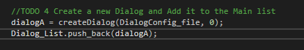

### DIALOG SYSTEMS
### WHO AM I?

I am Roger leon, student of the Bachelor’s Degree in Video Games by UPC at CITM, and 3D artist in my spare time.This content is made for the second year’s subject Project 2, under supervision of Ricard Pillosu and Marc Garrigó

### INTRODUCTION

Coinciding with Alexander Freed's, a best-seller novelist and professional in the industry with games such as Mass effect or Dragon Age, the creators of video games are very bad at dealing with the interaction of dialogues, and the reason is basically the complexity What it entails, it is easier to present a non-interactive story with a good narrative than to manage the complexity of a story with thousands and thousands of dialogue nodes in which each represents a piece of a possible ending. And the most important, "Games are remembered for their gameplay instead for their dialogue".

### So, what’s a Dialog System? 

Given my notions in programming and narrative, it has been a challenge to address this issue but after hours of research my interest could not do more than grow. So.. A Dialog System is a complex system of nodes in which each node contains certain information of an NPC to be able to take place a simulated conversation, either interactively or a simple narration with the player.

 
Node based dialog system for Unity

I can not talk about Dialog Systems without talking about Ron Gilbert, one of the precursors of the narrative in video games, such as Monkey Island, Maniac mansion or Thimbleweed Park, and he is not only a scriptwriter he’s also a programmer, and when two things so powerful join, only good things can come out, which we could define as the first Branch Dialog Trees, or as he calls them, Puzzle dialogs. I am not saying that he was the precursor of the Dialog Trees but where they shone, reaching the fame that Monkey Island had.

After looking for hours and hours on how to classify something as abstract as the Dialog Systems I will build on Alexander Freed's classification of the subject, which I personally think is exceptional. We can find several types of Dialog systems, which are explained alone, such as Non-Interactive or Simple Choices, on which the majority of currently successful games are based, such as Call of Duty or God of War. There are also those that by definition are usually RPG / RPG games, such as Hub and Spoke and Waterfall.

### Then why use Branch Tree Dialogs?

It is clear that when we have a protagonist like the Hero of Dragon quest IX we can not think of a Branch tree Dialog, since we are presented with a very defined storyline and a heroic deed and a character that barely speaks, but what happens when we approach a title like Baldurs Gate or Mass Effect? Missions in heaps, hundreds of dialogues to locate us and dozens of characters to each more complex at the time of having a conversation with them, which leads us to the question, how the hell can the studios face all this? The answer as you will have guessed is the Branch tree Dialogs.
Not only can we get the player to see himself reflected with every decision he makes, but we can manage multiple narratives or attributes, a perfect example would be Skyrim, when after hundreds of hours played we have the attributes to the maximum and there is no intimidating dialogue that resists us.

### Let’s begin with the types of tree Branch Dialog.

We found the most basic ones, such as non-interactive and simple choices, which, as I explained before, describe themselves, a simple tour through several nodes in which they contain the story in the case of non-interactive and small options in each node such as "Diplomacy!" or "You are far from your home" .., in the case of simple Choices, which are often used in strategy or role-playing games without much emphasis on history.

Then we start with the two most complex, the Hub and Spoke and the Waterfall. To understand the Hub and Spoke we can look at games like Skyrim or Baldur's Gate, since every dialogue that is presented to us is repeated and at any time we can rewind the text and repeat it as many times as we want. We will rarely be given a definitive option that greatly influences history Example:

-NPC- Hello! Are you the Dragonborn? YES-NO

-PLAYER- NO

-NPC- Ah okay sorry,bye bye.

START CONVERSATION AGAIN

-NPC- Hello! Are you the Dragonborn? YES-NO

-PLAYER- YES

-NPC- Wow! I Want to be like you!

-FINISH.

 
Fallout 3-NV-4 example of Speak and Hub

And here it stays. On the other hand, the Waterfall way would be the hardcore mode of the dialogues, in which when a user responds to a question from an NPC, it can not be repeated, being most of the times a choice that usually affects the story. A perfect example today would be Detroit Become Human, where the user almost at any time has to make a decision that apart from being non-repetitive greatly influences the progression of the game.

 
Banner Saga 2 example of waterfall

But since these last two methods are very versatile and useful when making an interactive text, it is very common to find them together, generating moments of tension when it is a game with dialogues Hub and spoke with touches of waterfall and generating a way to explore history more deeply when it is a waterfall with touches of Hub and Spoke, as Alexander Freed's himself affirms in his dialogues of Mass effect.

### So, How to develop and organize a Branch tree Dialog?

Normally it depends on the type you prefer to develop, but I'm going to focus on a mixture of Hub and spoke and Waterfall, since I think they are the two most interesting options and although we only touch the surface of what could be, I will try to explain the basic mechanisms and organization of these two types.

A Branch tree Dialog is divided into several parts, we will begin by explaining what the internal organization of a dialogue would be, which in turn is divided into X nodes that these in turn contain the options.

The most important thing to understand Tree dialogs is that we understand that these are a hierarchy of nodes with options within these nodes which will point to the next node depending on the response we give. Maybe this diagram will better represent my words:

 

This is the basic idea of a node of a dialog tree, each node has an ID, and each option of that node points to another tree dialog node, leaving such that:

 

This would be the theoretical organization of how each option node of the node we are selecting would point to the answer (from the NPC) to our response, to our input. Once the theory is seen, I will move on to a slightly more complex scheme to go further:

 

Now we can see how the thing is getting complicated. Each node has its own option that points to another node (note the difference in the blue and black dialogs since it is important to differentiate which is the text of the NPC, in this case the black texts, to the option that will be given the player, the blues). To be able to cross this tree we will need a pointer that points to the node in which we are (current node).

 

Starting from the previous scheme, we will begin to define our classes. My option has been to define a parent class that will control the current node (later I will generate one more class to control more than one Dialog) called Dialog System, in which a current node will be defined, and a list of tree Dialog nodes, which is the second class that we will define where we will create variables that support texts and a list of the last class, the Dialog Options. I want to comment that I will not focus on how I have done the behavior code of each class, if you want to observe how I did it in the end you can download the whole project.

## class Dialog System ()

 

As I explained before, this class will be where we control which node we will be pointing to and where we will load our list of nodes. (The variable Influence Level will be used later to explain how to add parameters to our list).

## class TreeDialogNode()

 

In this class we will define what ID the node will contain (to load it with an XML or a JSON), the text that will correspond to the NPC and a list with the possible options. The other variables in my case have helped me to control both the position of the text when rendering it, when doing a typewriter effect when rendering and controlling if a text is finished or too large to be rendered in a chart that is too small.

## Class DialogOptions()

 

Finally, the class of the dialog options will contain both a variable to support the text and to point to the next node. It will also help us to determine (in my case) if we want the text to be restarted when selecting this option (the Hub and Spoke style) or any attribute, as in Skyrim and the level of influence, in which if this option requires having a highest level of the current one or it is not shown or can not be selected.

**Time to SetUp the Nodes! :**

 

With this we covered the first part of our diagram, of course there’s a better and faster way to do this kind of dialogs but i thought that in order to understand how is structured a branch dialog tree it’s a good idea make the first steps manually. 
Here is a graphic example of how our conversation would be!

 

Once we understand the theory of how a small dialogue develops we will go one step further, to add several dialogs, so we create a new class called Dialog and move both the list of treeDialogNodes and the current node of the Dialog System class to the new Dialog class and in the DialogSystem we create the equivalents of the treeDialognode but with Dialog.

 

At this point one can begin to understand how cumbersome it would be to design a whole system of interactive dialogues manually adding nodes, one by one with their consequent choices in each of the characters ... would it become eternal truth? luckily there are many tools that facilitate this work, such as Chat-Mapper or game tools such as Dragon Age or neverwinter, but for this work I will focus on explaining how to make your own XML because although the editors mentioned above are very powerful many are paid or non-commercial and are node-based (although several of the node-based have options to export to JSON).

### How to organize an XML for a Dialog System?

The most important thing before starting the XML is to create a diagram of how the dialogues will happen, in order to create a first image of where i will point to each node. Starting from the base of the scheme that we have been using we will start defining our XML correctly. The best option is to divide the dialogues as well as the nodes into sections, giving great importance to the IDs.
I recommend starting with a small section where we will save variables of need to make a correct Setup of our dialogues, such as Characters, Dialog Charts, paths ... etc:

 

To correctly structure a single conversation we start by defining the ID of the dialogue in which it will happen, then we start defining the first node, along with the first ID and we think about what attributes can come to us well as for example, which Character will be in charge of saying these words , or where we will place this dialog chart, etc. Then, within this node we define another label that will be the string, in my case I have called it "<NPCTalk> Followed by the options with their corresponding ID's, the text i defining a which node they will point to once the option is selected.

 

**Dialog ID**  This is where we define our conversation, keep in mind to increase the value of the ID each dialogue.

**Node** It is the core of the conversation, where we will define both the options and the text.
**Attributes** In this section, we will place any variable that helps us to have better control or interpret the text better.

**NPCTalk** Here we define the text that the Npc will say in the corresponding node.

**Option** Each option that we want to implement our conversation should be defined by this label. It is who will contain the necessary information to know which node we will point to. I have also defined a startAgain variable, to control if I want to start the event again.

**IMPORTANT!** : In my case, I have defined that when the NextNode return "0" implies that the dialog in which this node is has no Options (if it is only), and if returns "-1" means that the text is finished when selecting this option.

By repeating the process step by step, we can create as many dialogues as we want.

Once I understand how to structure a branch tree Dialog and the XML it is time to move on to control the code that I leave below. To control the library that I have created it is necessary to take into account some Functions.

## THE FUNCTIONS 
First of all, it is necessary to know that the system in which I use my dialogues depends a lot on the dialog textures that we have selected, since the text will be totally adapted to the form that the Chart dialogue has. Therefore we start using the two functions that create us both the characters and the charts:

**bool createCharacters(pugi::xml_document &Dialog)** ->this function creates the characters defined in the XML.

**bool SetUpCharts(pugi::xml_document &Dialog)** -> this function creates the Dialog Charts defined in the XML.

Once we have this, we declare what our first Dialogue will be and with the corresponding function to create it.

**Dialogue createDialog(pugi::xml_document& Dialog, int ID)** -> This function returns a set of nodes that will form our dialog defined in the XML depending on the ID that we give it. Remember to add each dialog to the list of dialogs in order to clean them later.

**void StartDialogEvent(Dialogue Dialog)** -> Finally we have this function that will help us to start any dialogue event;

## NOW it’s your turn! 

**TODO 0 : Here you have a little bit of work, Open paint, Photoshop or some Diagram software and make your own diagram. Only two or three nodes like the example i’ve done.**

**TODO 0.1 : Now in the XML file start writing the first Node.**

**TODO 0.1 - SOLUTION** I used the diagram used below, and Added to the first NPCTalk, in this case I’ve only added one Character, you are free to use as many characters as you want

 

**TODO 1: Create the options In order to answer the NPC dialog, remember later to point the next node to the correct answer!.**

**TODO 1 - SOLUTION** Remember to Add later the NextNode ID
 

**TODO 2: Create the new Node following your diagram to answer the firsts options.**

**TODO 3: Now make all the nodes to complete the diagram!**

**TODO 2&3 - SOLUTION**  With some patience You can create a full dialog. Have in account the variables of StartAgain if you want to restart the dialog when it finish.

 

**TODO 4 : Create the Dialog_List and a new dialog and use the correct function to fill it. remember to add it to the list.**

**TODO 4 - SOLUTION**  Remember to use the correct Dialog ID.

 
 

**TODO 5: Create a new treeDialogNode and fill its variables in order to define it, Remember the main functions as SetNodeID()**

**TODO 5 - SOLUTION**  See the functions of the treeDialog node and fill it with the correct names.
 

**TODO 6:  Write the condition to explore the next node ID in order to point from the dialogOption to the nextNode**

**TODO 6 - SOLUTION**  This is a tricky one, in order to point the nexnode variable correctly from the XML you have to go through all the tree to fund the correct treeDialogNode with the correct ID ( i’ve already done  ) so compare if the iD of the Item Options with the treedialogNode and point it correctly

 

**TODO 7: Go through the list in order to call the cleanUp of the inner attribute**

**TODO 7 - SOLUTION** create a list and go through the treeDialogNode and DialogOptions and do a CleanUp();

 

**TODO 8: Call the function to start the dialog!.**

**TODO 8 - SOLUTION** The last One! You only have to call the StartDialogEcent() with the Dialog you have already created and Voila! now you might able to see and interact with the blue square!

 

Now the code it’s yours, With all my effort i made a simple final fantasy look like game to show who the potential can be if you use all your imagination. Now, the limit is the SKY!.

 
  Source Code to see as a example

Thanks to all those who have had the patience and curiosity to read my research and I ask you, please, send me to rleonborras@gmail.com any questions you have or show me all your designs!

## WEBGRAPHY
[Ron Gibert Blog, Puzzle Dialogs](https://blog.thimbleweedpark.com/dialog_puzzles)

[Alexander Freed, Typology and writing a Branching Dialog tree](http://www.gamasutra.com/blogs/AlexanderFreed/20140902/224609/Branching_Conversation_Systems_and_the_Working_Writer_Part_1_Introduction.php)

[Analysis of structure of a DialogTree](https://www.gamasutra.com/view/news/114503/Analysis_Conversation_Design_In_Games.php)

[Deep Patterns of dialog systems](http://www.digra.org/wp-content/uploads/digital-library/09287.59480.pdf)

[Designing a dialog system](https://thegamekitchen.com/blog/designing-a-dialog-system-for-chapter-two/)

[Dialog system for unity, how it works](https://holistic3d.com/news-tips/dialogue-tree-tutorial/)

[TreeDialog systems with Pointers](https://www.youtube.com/watch?v=W4TV-_-Wcw4)

